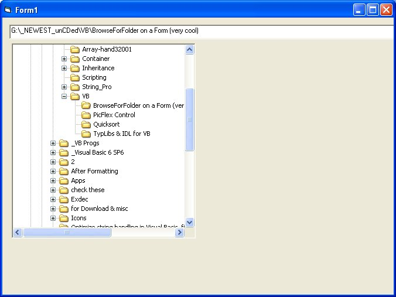



## API Created Folder Tree \- this is the real one Windows uses, not a user control \!\!

### Description

API Created Folder Tree - this is the real one Windows uses, not a user control !!

the code is not mine, i only cleaned it up a little,whatever...
 
### More Info
 

             |
---                |---
**Submitted On**   |2004-12-30 23:38:48
**By**             |[M\. J\. Highlander](https://github.com/Planet-Source-Code/PSCIndex/blob/master/ByAuthor/m-j-highlander.md)
**Level**          |Advanced
**User Rating**    |4.9 (78 globes from 16 users)
**Compatibility**  |VB 6\.0
**Category**       |[Miscellaneous](https://github.com/Planet-Source-Code/PSCIndex/blob/master/ByCategory/miscellaneous__1-1.md)
**World**          |[Visual Basic](https://github.com/Planet-Source-Code/PSCIndex/blob/master/ByWorld/visual-basic.md)
**Archive File**   |[API\_Create183680152005\.zip](https://github.com/Planet-Source-Code/m-j-highlander-api-created-folder-tree-this-is-the-real-one-windows-uses-not-a-user-contro__1-58113/archive/master.zip)

